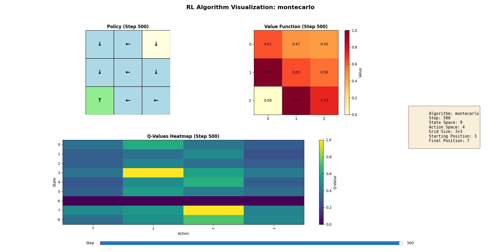

# RL Basics: Policy, Evaluation, and Control

This repository implements fundamental reinforcement learning (RL) algorithms for Markov Decision Processes (MDPs) using a grid-based environment. The main components are policy representation, policy evaluation, and policy control techniques.

## Environment

- [`MDP_GridSearch`](environment.py): Represents the grid-based MDP environment. States and actions are encoded as integers and strings, respectively. The environment supports random and deterministic policies, computes reward matrices, and generates episodes for learning.

### Grid World Setup

The environment is defined by a **matrix** that represents the grid world:

```python
matrix = np.array([
    [0, 1, 0],
    [0, 0, 0],
    [1, 0, 0]
])
```

- **Matrix dimensions**: An `n×n` matrix defines an `n×n` grid world
- **Matrix values**: Each cell contains the **reward** the agent receives when entering that state
  - `0`: No reward (neutral state)
  - `1`: Positive reward (goal or favorable state)
  - Negative values can represent penalties or obstacles
- **State numbering**: States are numbered from 1 to n², reading left-to-right, top-to-bottom
  - For a 3×3 grid: states are numbered 1, 2, 3 (top row), 4, 5, 6 (middle row), 7, 8, 9 (bottom row)

**Example Configuration**:
```python
starting_position = 3  # Agent starts at state 3 (top-right corner)
final_position = 7     # Goal is at state 7 (bottom-left corner, reward=1)
```

The agent navigates the grid using four actions: **up (↑), down (↓), left (←), right (→)**, receiving rewards based on the matrix values as it moves through states.

## Policy Representation

A **policy** defines the agent's behavior by mapping states to actions. In this workspace:
- Policies can be random (stochastic) or deterministic.
- Policies are represented as vectors (deterministic) or matrices (stochastic, with action probabilities per state).

## Policy Evaluation

Policy evaluation estimates the value function for a given policy, i.e., the expected return from each state when following the policy.

Implemented techniques:
- **Iterative Policy Evaluation**: [`iterative_algorithm_policy_evaluation`](policy_evaluation.py) computes state values by iteratively applying the Bellman expectation equation until convergence.
- **Monte Carlo Policy Evaluation**: [`montecarlo_policy_evaluation`](policy_evaluation.py) uses sampled episodes to estimate state values via first-visit returns.
- **Temporal Difference (TD) Policy Evaluation**: [`temporal_difference_policy_evaluation`](policy_evaluation.py) updates state values using bootstrapped estimates from sampled transitions.

## Policy Control

Policy control aims to find the optimal policy that maximizes expected returns.

Implemented techniques:
- **Policy Iteration**: [`policy_iteration`](optimal_policy_search.py) alternates between policy evaluation and policy improvement until convergence.
- **Value Iteration**: [`value_iteration`](optimal_policy_search.py) iteratively updates state values and derives the optimal policy.
- **Epsilon-Greedy Policy**: [`eps_greedy_policy`](optimal_policy_search.py) balances exploration and exploitation by selecting the best action with probability `1-epsilon` and a random action otherwise.
- **Monte Carlo Model-Free Control**: [`montecarlo_model_free_on_policy`](optimal_policy_search.py) uses first-visit MC updates and epsilon-greedy improvement to learn optimal policies without a model.
- **TD Model-Free Control (SARSA)**: [`td_model_free_on_policy`](optimal_policy_search.py) learns policies using TD updates and on-policy epsilon-greedy exploration.
- **Q-Learning Model-Free Control**: [`q_learning_model_free_off_policy`](optimal_policy_search.py) learns optimal policies using off-policy TD updates and epsilon-greedy exploration.
- **Deep Q-Network (DQN)**: [`dqn`](value_function_approximator.py) uses neural networks to approximate Q-values and optimize policies via experience replay and target networks.

## Visualization

The repository includes a comprehensive visualization tool ([`visualization.py`](visualization.py)) that provides interactive dashboards for analyzing RL algorithms. The visualizer displays:

- **Policy Grids**: Visual representation of the learned policy with directional arrows showing the optimal action for each state
- **Value Function Heatmaps**: Color-coded visualization of state values showing which states are most valuable
- **Q-Value Heatmaps**: Matrix visualization of Q-values for all state-action pairs
- **Training Progress**: Real-time tracking of learning dynamics across episodes
- **Interactive Slider**: Step through the learning process to observe how policies and values evolve over time

### Creating Visualizations

To visualize a single algorithm with interactive controls:

```python
from visualization import RLVisualizer
from environment import MDP_GridSearch
import numpy as np

# Create environment
matrix = np.array([[0, 0, 0], [0, 0, 0], [1, 0, 0]])
mdp = MDP_GridSearch(matrix, starting_position=3, final_position=7)

# Visualize DQN training
visualizer = RLVisualizer(mdp, algorithm_name="dqn")
visualizer.create_dashboard(steps=30, num_episodes=500)
```

To compare multiple algorithms side-by-side:

```python
from visualization import visualize_algorithm_comparison

visualize_algorithm_comparison(mdp, steps=20, num_episodes=100)
```

### Supported Algorithms for Visualization

- `policy_iteration` - Model-based policy iteration
- `value_iteration` - Model-based value iteration  
- `montecarlo` - Monte Carlo model-free on-policy control
- `td_sarsa` - Temporal Difference SARSA on-policy control
- `q_learning` - Q-Learning off-policy control
- `dqn` - Deep Q-Network with neural network approximation

### Example Visualization Output

The dashboard provides a comprehensive view of the learning process:



*The visualization shows the policy grid (left), value function heatmap (center), Q-value matrix (bottom), and algorithm information (right). Use the slider at the bottom to step through training episodes and observe how the agent learns over time.*

## Usage

Run any of the main scripts to see the algorithms in action. For example:

```sh
python optimal_policy_search.py
```

This will print the results of policy iteration, value iteration, Monte Carlo, TD, and Q-learning algorithms.

To launch the interactive visualization:

```sh
python visualization.py
```

## Requirements

See [requirements.txt](requirements.txt) for dependencies. Key requirements include:
- `numpy` - Numerical computations
- `torch` - Deep learning for DQN
- `matplotlib` - Visualization and plotting

## File Overview

- [environment.py](environment.py): MDP environment and episode generation
- [policy_evaluation.py](policy_evaluation.py): Policy evaluation algorithms
- [optimal_policy_search.py](optimal_policy_search.py): Policy control algorithms
- [value_function_approximator.py](value_function_approximator.py): DQN implementation with neural networks
- [visualization.py](visualization.py): Interactive visualization dashboard for analyzing RL algorithms

## References

- Sutton & Barto, "Reinforcement Learning: An Introduction"